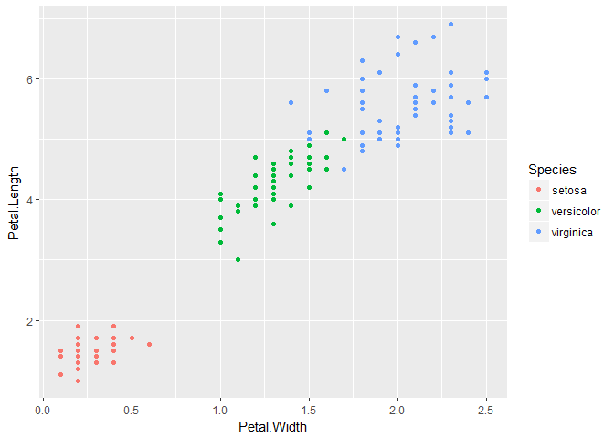

Tarea Unidad 1
================

Tema 1
------

Tenemos que sumarizar nuestras variables, hemos visto funciones de resumen en el curso pero dada la flexibilidad de R hay cientos de formas de aplicarlas, en este caso decidí aplicar los afamados "pipes" (para esto hay que llamar el paquete "dplyr" )

``` r
library(moments)
library(dplyr)
```

    ## 
    ## Attaching package: 'dplyr'

    ## The following objects are masked from 'package:stats':
    ## 
    ##     filter, lag

    ## The following objects are masked from 'package:base':
    ## 
    ##     intersect, setdiff, setequal, union

``` r
iris%>%
  summarise(media=mean(Sepal.Length),mediana=median(Sepal.Length),varianza=var(Sepal.Length),desv=sd(Sepal.Length),Asimetria=skewness(Sepal.Length),Curtosis=kurtosis(Sepal.Length))
```

    ##      media mediana  varianza      desv Asimetria Curtosis
    ## 1 5.843333     5.8 0.6856935 0.8280661 0.3117531 2.426432

Tema 2
------

Y ahora hare lo mismo para el tema 2

``` r
iris%>%
  group_by(Species)%>%
  summarise(media=mean(Sepal.Length),desviacion=sd(Sepal.Length))
```

    ## # A tibble: 3 x 3
    ##   Species    media desviacion
    ##   <fct>      <dbl>      <dbl>
    ## 1 setosa      5.01      0.352
    ## 2 versicolor  5.94      0.516
    ## 3 virginica   6.59      0.636

Tema 3
------

Esto puede ser empleado igualmente para el tema 3

``` r
iris%>%
  group_by(Species)%>%
  summarise(covarianza=cov(Petal.Length,Petal.Width),R2=cov(Petal.Length,Petal.Width)^2)
```

    ## # A tibble: 3 x 3
    ##   Species    covarianza        R2
    ##   <fct>           <dbl>     <dbl>
    ## 1 setosa        0.00607 0.0000368
    ## 2 versicolor    0.0731  0.00534  
    ## 3 virginica     0.0488  0.00238

Tema 4
------

Para el tema 4 decidí usar ggplot2, pero podia ser hecho igualmente con plot.

``` r
library(ggplot2)
ggplot(iris,aes(x=Petal.Width,y=Petal.Length, color=Species))+
  geom_point()
```



Tema 5
------

El tema 5 es un poco largo de realizar realmente, pero en principio es bastante sencillo:

``` r
p1<-t.test(iris$Petal.Length,mu=5,alternative="greater")
p2<-t.test(iris$Petal.Length,mu=1.2,alternative="less")
p3<-t.test(iris$Petal.Length,mu=1.6,alternative="two.sided")
print(c(p1$p.value,p2$p.value,p3$p.value))
```

    ## [1] 1.000000e+00 1.000000e+00 1.658041e-31

Hubiese sido bueno ver un pequeño comentario al lado de cada una de las pruebas (o debajo), dicutiendo los resultados de cada una, por lo menos decir que dio cada prueba o algo...

Tema 6
------

Para el último tema podemos usar el comando pairwise.t.test

``` r
attach(iris)
pairwise.t.test(Petal.Width,Species,p.adj="none",alternative="greater")
```

    ## 
    ##  Pairwise comparisons using t tests with pooled SD 
    ## 
    ## data:  Petal.Width and Species 
    ## 
    ##            setosa versicolor
    ## versicolor <2e-16 -         
    ## virginica  <2e-16 <2e-16    
    ## 
    ## P value adjustment method: none
