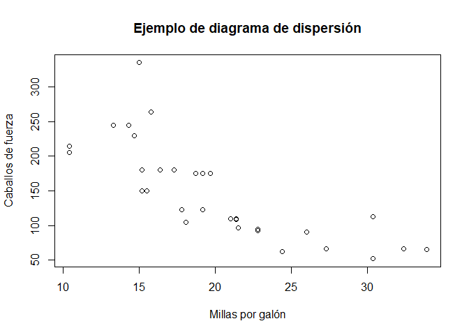
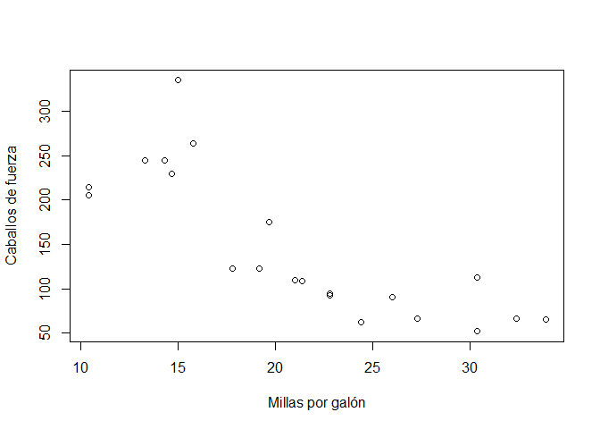

## Tarea Gestión de Datos
Ya que tenemos r instalado, procedamos a cargar el dataframe mtcars y a ver las estadísticas descriptivas de las variables


```r
dt<-mtcars
summary(dt)
```

```
##       mpg             cyl             disp             hp       
##  Min.   :10.40   Min.   :4.000   Min.   : 71.1   Min.   : 52.0  
##  1st Qu.:15.43   1st Qu.:4.000   1st Qu.:120.8   1st Qu.: 96.5  
##  Median :19.20   Median :6.000   Median :196.3   Median :123.0  
##  Mean   :20.09   Mean   :6.188   Mean   :230.7   Mean   :146.7  
##  3rd Qu.:22.80   3rd Qu.:8.000   3rd Qu.:326.0   3rd Qu.:180.0  
##  Max.   :33.90   Max.   :8.000   Max.   :472.0   Max.   :335.0  
##       drat             wt             qsec             vs        
##  Min.   :2.760   Min.   :1.513   Min.   :14.50   Min.   :0.0000  
##  1st Qu.:3.080   1st Qu.:2.581   1st Qu.:16.89   1st Qu.:0.0000  
##  Median :3.695   Median :3.325   Median :17.71   Median :0.0000  
##  Mean   :3.597   Mean   :3.217   Mean   :17.85   Mean   :0.4375  
##  3rd Qu.:3.920   3rd Qu.:3.610   3rd Qu.:18.90   3rd Qu.:1.0000  
##  Max.   :4.930   Max.   :5.424   Max.   :22.90   Max.   :1.0000  
##        am              gear            carb      
##  Min.   :0.0000   Min.   :3.000   Min.   :1.000  
##  1st Qu.:0.0000   1st Qu.:3.000   1st Qu.:2.000  
##  Median :0.0000   Median :4.000   Median :2.000  
##  Mean   :0.4062   Mean   :3.688   Mean   :2.812  
##  3rd Qu.:1.0000   3rd Qu.:4.000   3rd Qu.:4.000  
##  Max.   :1.0000   Max.   :5.000   Max.   :8.000
```
Procedemos a graficar la data


```r
attach(mtcars)
plot(mpg,hp,main="Ejemplo de diagrama de dispersión", xlab="Millas por galón", ylab="Caballos de fuerza")
```



Ahora procederemos a crear la variable 'rapido'

```r
dt$rapido<-ifelse(gear>3 | hp>180,1,0)
summary(dt$rapido)
```

```
##    Min. 1st Qu.  Median    Mean 3rd Qu.    Max. 
##  0.0000  0.0000  1.0000  0.6875  1.0000  1.0000
```
Luego de crearla, graficaremos de nuevo solo con el subset de carros 'rapidos' variable:

```r
data<-dt[dt$rapido==1,]
plot(data$mpg,data$hp,xlab='Millas por galón', ylab='Caballos de fuerza')
```

<!-- -->

## Tarea Programación
El primer punto es relativamente facil cuando conocemos la funcion %% que extrae el módulo de dos números:


```r
m<-logical(20)
for(i in 1:20){
 m[i]<-i%%4==0
}
m
```

```
##  [1] FALSE FALSE FALSE  TRUE FALSE FALSE FALSE  TRUE FALSE FALSE FALSE
## [12]  TRUE FALSE FALSE FALSE  TRUE FALSE FALSE FALSE  TRUE
```
El segundo es un poco mas complicado, pero tambien es simple.


```r
k<-5
n_iter<-0
while (k>4 & n_iter<50){
  k<-(k-0.015)
  n_iter=n_iter+1
}
k
```

```
## [1] 4.25
```

## Tarea Extra

Viendo los extras, para el primero hay que pensar un poco como sería la lógica del programa: Personalmente yo lo enfrenté utilizando los operandos mod (\%\%, que da el residuo de la division entre dos numeros) y floor() (que redondea hacia abajo cualquier decimal, en este caso lo usamos para una división) 


```r
#parametros
cantidad<-61
denom_billetes<-c(50,20,10,5,1)
denom_billetes<-sort(denom_billetes,decreasing=TRUE)
vect_sol<-rep(0,length(denom_billetes))
#Procesamiento
for(i in 1:length(denom_billetes)){
  vect_sol[i]<-floor(cantidad/denom_billetes[i])
  cantidad<-cantidad%%denom_billetes[i]
}
vect_sol
```

```
## [1] 1 0 1 0 1
```
Ahora para la sucesión de Fibonacci, en realidad es bastante simple googlearlo y ver la solucion en internet, pero es importante que nos esforcemos por entender lo que encontramos en internet, a continuación el código.


```r
n<-17
fibonacci<-numeric(n)
fibonacci[1]<-1
fibonacci[2]<-1
for(i in 3:n){
  fibonacci[i]<-fibonacci[i-1]+fibonacci[i-2]
}
print(fibonacci[n])
```

```
## [1] 1597
```
